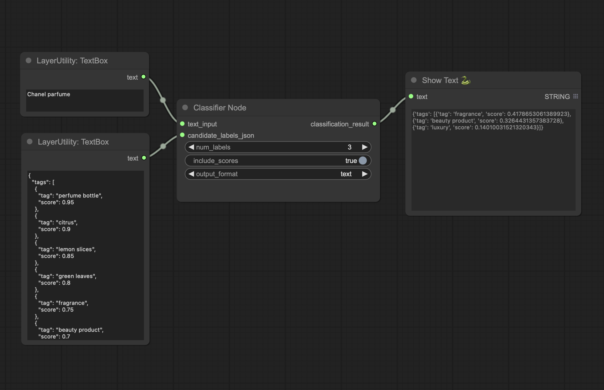

# ComfyUI-Classifier

ComfyUI-Classifier is a custom node for [ComfyUI](https://github.com/comfyanonymous/ComfyUI) that uses a zero-shot classification model to classify text inputs based on a set of candidate labels. This node leverages the power of Hugging Face Transformers to provide accurate and flexible text classification.



## Features

- **Text Classification**: Classify text inputs using zero-shot classification.
- **Customizable Labels**: Provide your own set of candidate labels for classification.
- **Flexible Output**: Choose between JSON or plain text output formats.
- **Score Inclusion**: Option to include classification scores in the output.

## Installation

1. **Clone the Repository**: Clone this repository into your `custom_nodes` folder in ComfyUI.

    ```bash
    git clone https://github.com/fexploit/ComfyUI-Classifier custom_nodes/ComfyUI-Classifier
    ```

2. **Install Dependencies**: Navigate to the cloned folder and install the required dependencies.

    ```bash
    cd custom_nodes/ComfyUI-Classifier
    pip install -r requirements.txt
    ```

## Usage

### Adding the Node

1. Start ComfyUI.
2. Add the `ClassifierNode` from the custom nodes list.
3. Connect a text input and configure the parameters as needed.

### Parameters

- `text_input` (required): The input text to be classified.
- `candidate_labels_json` (required): A JSON string containing the candidate labels and their initial scores.
- `num_labels` (optional): Number of labels to select (default: 10).
- `include_scores` (optional): Boolean flag to include scores in the output (default: True).
- `output_format` (optional): The output format, can be "json" or "text" (default: "json").

## Example

```python
# Example usage in a script
text_input = "Dune is the best movie ever."
candidate_labels_json = '''
[
  {"tag": "CINEMA", "score": 0.9},
  {"tag": "ART", "score": 0.1},
  {"tag": "MUSIC", "score": 0.05}
]
'''

classifier_node = ClassifierNode()
output = classifier_node.classify(text_input, candidate_labels_json, num_labels=3, include_scores=True, output_format="json")
print(output)
```

## Contributing

Contributions are welcome! If you have any improvements, bug fixes, or new features to suggest, please feel free to open an issue or submit a pull request with your changes. Make sure to follow the project's code style and add tests for any new functionality.

## License

This project is licensed under the MIT License. See the [LICENSE](LICENSE) file for more details.

## Acknowledgements

- [ComfyUI](https://github.com/comfyanonymous/ComfyUI) for providing the platform to build this custom node.
- [Hugging Face Transformers](https://huggingface.co/transformers) for their powerful and flexible NLP models.

## Contact

For any inquiries, suggestions, or issues, please open an issue on the [GitHub repository](https://github.com/fexploit/ComfyUI-Classifier).
